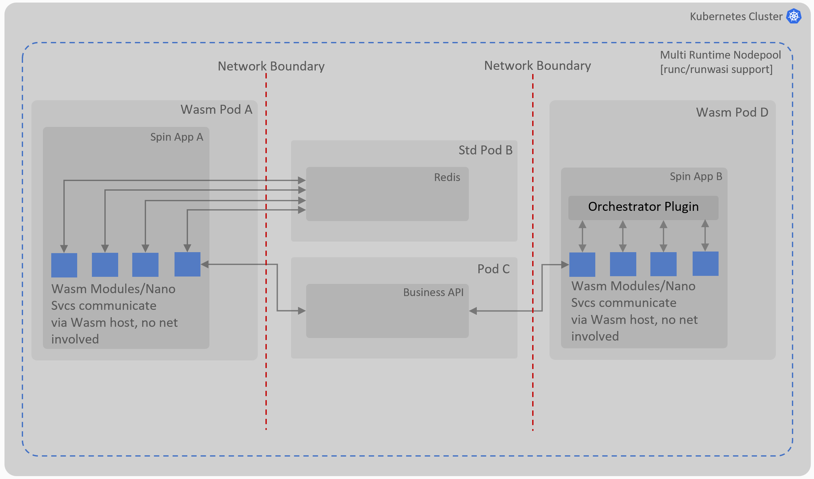

# Mixed Workloads with Web Assemblies (Spin) & Containers, with Reduced Network Hops

## Background

Web assembly (Wasm) is positioned to be the next interation of serverless compute ecosystem, the serverless aspect of Wasm is hugely attractive as it allows you to write functions in a decoupled and portable manner. Decoupled, because you write functions' code which is not dependent on the host and environment (cloud provider bindings) it's running in, Matt Butcher from Fermyon wrote an amazing article on this [here](https://www.fermyon.com/blog/next-generation-of-serverless-is-happening?utm_content=251765820&utm_medium=social&utm_source=twitter&hss_channel=tw-1444404500437995520) which sets the context right away.
Portability aspect of Wasm comes from the fact that you compile your code to a Wasm bytecode (a bit like .Net MSIL or Java Bytecode) and this bytecode can then run independent of the host architecture in Wasm runtimes (e.g. wasmtime).
Nevertheless, this repo is less about convincing you to make use of Wasm, it's more about how you can run Wasm functions (also know as modules or components) along side conventional OCI containers; this is likely to be the most common use case when you start considering Wasm for your solution. One of the reasons for that could well be that Wasm is not currently ready for running server (this is different to serverside workloads) workloads e.g. DBs, for that a conventional container is still a better (or only) choice. Since Kubernetes (K8s) is one of the most commonly used platforms for orchestrating containers, it would make sense to use it as a starting point to run mixed workloads. This repo makes use of [K3d](https://k3d.io) to run OCI containers and Wasm containers in mixed mode.

## How Do We Run Wasm on Kubernetes (K8s)

The solution makes use of Spin shim for containerd, please refer to [Wasm on K8s doc](../wasm-orchestration-with-spin/docs/wasm-on-k8s.md) for more details.

## Solution Overview

This solution builds and deploys a psuedo ordering application to examplify the mixed workloads on Kubernetes. Additionaly, it demonstrates the inter Wasm communication without network hopping, this part of solution is explained [below](#reduced-network-hops).

Following components are the key parts of this solution:

[TODO: Add solution diagram]

1. K3d Cluster: a local kubernetes cluster running both Wasm containers and standard OCI containers.
2. Spin Shim: an updated version of Spin shim which includes both http and redis trriggers.
3. Spin Orchestrator Plugin (WIP): a custom built plugin to enable Spin components to communicate with each other without a network hop.
4. Spin Apps:
    1. OrderProcessor App:

    2. OrderFulfilment App:

This will run the standard Spin application which may contain multiple Wasm components/modules as part of it. These components communicate with each other using Spin SDKs (for KV, Redis or Http). This approach allows decoupling these components via messaging (Redis) or contracts (Http REST) and this is great. On the flip side though, by introducing external means to communicate between the components, additional overheads become inevitable.

The diagram below compares and contrasts the differences between the use of external services for inter module/component communication and an approach where we avoid this. On the left-hand side, Pod A has four Wasm components/modules, communication between these components occur via an external service (Redis in this case). Should we not need to expose these events to external (to Spin app) entities or there's a need for async communication, we really do not need to cross the network boundary here.
Now compare this with Pod D (on the right), where inter module/component communication occur via a custom Spin plugin, the event/messages stay within the same Spin app and no network boundary is crossed. When event/messages do need to be exposed to external world they can certainly do that. This approach is defined in [Reduced Network Hop](#reduced-network-hops) section below.

Drawing some parallels here from code level and service level design patterns, intra Spin orchestration of modules can be considered as nano services which do not need to cross the boundary of network but still need to be composed together to form a business logic. By not involving network, we avoid the complex compensation logic (idempotency, circuit-breaker) in absence of transactions and serialisation-deserialization of messages. WIT contracts defined in the custom plugin allows a contract driven development of Wasm modules/components in a polyglot manner.

The next section below addresses this aspect of the solution in Spin.

### Reduced Network Hops

This approach enables intra Spin (within the same Spin instance) module/component orchestration using WIT contracts at the host level. It makes use of the plugin model extensibility Spin provides to build a domain specific orchestrator (a custom plugin). Domain specific plugin references a set of WIT contracts for multiple Wasm modules/components and invoke functions on Wasm modules/components as per domain specific logic. These composed services may eventually then interact with other services (could be Spin based or otherwise) on the network using standard Spin SDKs e.g. Http.

## Local Deployment

Please refer to [dev setup document](../wasm-orchestration-with-spin/docs/dev.md) for local setup of the solution.
